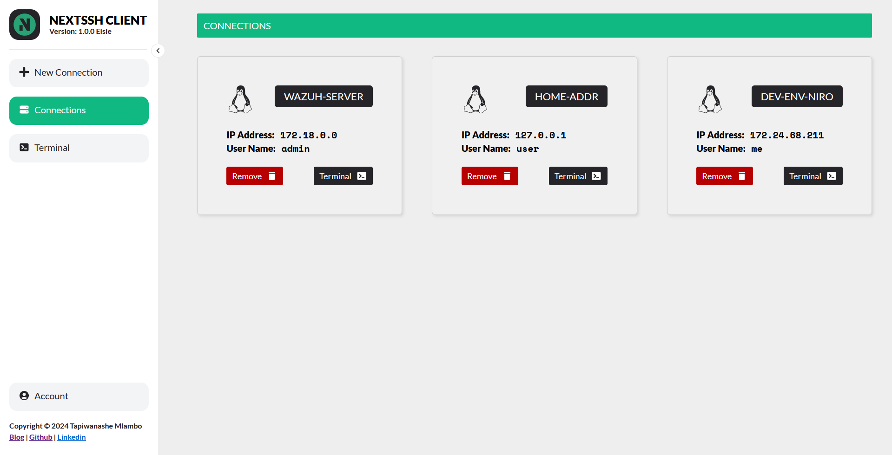

# NeXTSSH: A Web-based SSH Client and Terminal Emulator

Connect to and command your remote servers effortlessly with **NeXTSSH**, a web-based SSH client and terminal emulator. Master your systems directly from your browser!

## Key Features

- **Seamless SSH Connections:** Establish secure connections to your remote servers with ease.
- **Responsive Terminal Experience:** Enjoy a fluid, full-featured terminal right in your web browser.
- **Organized Connection Management:** Conveniently manage multiple server connections.

## Technologies

- [NextJS](https://nextjs.org): Blazing-fast [React](https://reactjs.org)-based web framework.
- [NodeJS](https://nodejs.org): Robust JavaScript runtime environment.
- [Socket.io](https://socket.io): Real-time, bi-directional communication for seamless updates.
- [Xterm.js](https://xtermjs.org): Robust terminal emulation in the browser.
- [SSH2](https://npmjs.com/package/ssh2): Comprehensive SSH2 implementation for NodeJS.

## Local Development

1. Clone the Repository:
   ```bash
   git clone https://github.com/tapiwamla/NeXTSSH.git
   ```

2. Install Dependencies:
   ```bash
   npm install
   ```

3. Add Environment Variables:
   Create a `.env` file with the following content:
   ```bash
   NEXTAUTH_SECRET='your-secret-key' # Use `openssl rand -base64 32` to generate a secret key
   GITHUB_CLIENT_ID='your-client-id'
   GITHUB_CLIENT_SECRET='your-client-secret'
   ```

   To get the GITHUB_CLIENT_ID and GITHUB_CLIENT_SECRET, follow these steps:
   - Go to GitHub Developer Settings:
     - Visit GitHub Developer Settings.
   - Create a New OAuth App:
     - Under the "OAuth Apps" section, click "New OAuth App".
   - Fill in the Application Details:
     - Application Name: Enter a name for your app (e.g., "Next.js App").
     - Homepage URL: Enter your application's URL (e.g., http://localhost:3000 for local development).
     - Authorization Callback URL: Enter the callback URL for your app. For NextAuth, this is typically:
       ```
       http://localhost:3000/api/auth/callback/github
       ```
   - Register the Application:
     - Click "Register Application".
   - Copy the Client ID and Client Secret:
     - After registering, you will see the Client ID on the app's page.
     - Click "Generate a new client secret" to get the Client Secret.

   **Note:** The `NEXTAUTH_SECRET` value is optional for development, but **required** for production.

4. Start the Development Server:
   ```bash
   npm run dev
   ```
   
   For production, first build the project:
   ```bash
   npm run build
   ```
   Then start the server:
   ```bash
   npm run start
   ```

## Testing

- The project includes [Jest](https://jestjs.io/) for unit testing.
- Run unit tests:
   ```bash
   npm test
   ```

## Screenshots

### Landing Page:


### Connection Page:


### Connections Dashboard:


### Terminal Page:


### Account Page:


### Dark Mode:


## Contributing

- NeXTSSH was passionately crafted by [Tapiwanashe Mlambo](https://tapiwamla.me), a graduate of the Bachelor of Science in Applied Computer Technology from [USIU-Africa](https://usiu.ac.ke).
- Want to make NeXTSSH even better? I welcome contributions! Feel free to open issues, submit pull requests, or suggest new features. Let's build together!
- If you find NeXTSSH useful, a star on the GitHub repo would be awesome!

## Additional Notes

- **Security:** NeXTSSH handles SSH connections. Ensure you follow best security practices and use strong credentials.
- **Deployment:** Explore suitable hosting options (like cloud providers) for production deployment.